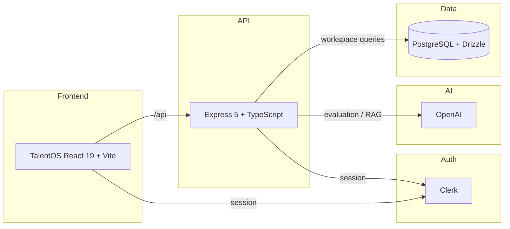

# TalentOS — AI-Powered Recruitment & Developer Evaluation Platform

TalentOS is a full-stack recruitment platform that combines authenticated workspace management, typed API contracts, and AI-assisted hiring signals. It is built as a portfolio-grade engineering project demonstrating production-ready patterns across React, Express, PostgreSQL, and OpenAI integrations.

## Key Capabilities

- **AI candidate evaluation** — structured candidate-to-job fit scoring via OpenAI
- **Grounded RAG knowledge assistant** — PostgreSQL full-text-search retrieval with LLM-grounded answers
- **Workspace-scoped CRUD** — jobs, candidates, assessments, knowledge sources, and automations
- **Clerk authentication** — managed auth with per-user workspace isolation
- **Read-only MCP tool layer** — internal JSON-RPC interface for workspace data access
- **Production API hardening** — rate limiting, security headers, env validation, health checks
- **OpenAPI 3.1 source of truth** — Orval-generated React Query client + Zod schemas
- **CI/CD** — GitHub Actions with typecheck, tests, and build
- **Docker support** — multi-stage builds for API and frontend

## Architecture



## Tech Stack

| Layer | Technology |
|-------|------------|
| Frontend | React 19, Vite, Wouter, TanStack Query, Tailwind CSS |
| API | Express 5, TypeScript, Pino |
| Database | PostgreSQL, Drizzle ORM |
| Auth | Clerk |
| Validation | Zod, drizzle-zod |
| API Contracts | OpenAPI 3.1, Orval |
| Testing | Vitest, Supertest |
| CI | GitHub Actions |
| Containerization | Docker, Docker Compose |

## AI Architecture

TalentOS integrates AI as decision support, not autonomous hiring.

- **Provider abstraction** — OpenAI calls are isolated behind a service layer
- **Structured outputs** — Zod-validated evaluation responses with scores, strengths, gaps, and recommendation
- **Retrieval** — PostgreSQL full-text search ranks relevant knowledge sources
- **Grounded answers** — RAG responses are restricted to retrieved sources; insufficient evidence returns an explicit fallback
- **Tool layer** — read-only MCP-style tools (`get_candidate`, `list_jobs`, `get_dashboard_metrics`, etc.) enforce workspace isolation

## Security

- Clerk session authentication on protected routes
- Per-user workspace isolation at the data layer
- CORS allowlist with production enforcement
- Rate limiting on AI and RAG endpoints
- Security headers: `X-Content-Type-Options`, `X-Frame-Options`, `Referrer-Policy`, `Strict-Transport-Security` in production
- Request body limits (1MB JSON / URL-encoded)
- Startup environment validation with non-secret error messages
- Secrets never exposed to the browser bundle

## Testing

- 25 passing tests with Vitest + Supertest
- Coverage: environment validation, health/readiness, rate limiting, request hardening, security headers, and API contract behavior
- `pnpm run typecheck` and `pnpm run build` verified in CI

## Local Setup

```bash
# 1. Clone and install
git clone https://github.com/<your-username>/talentos.git
cd talentos
pnpm install

# 2. Configure environment
cp .env.example .env
# Add DATABASE_URL, Clerk keys, and optional OpenAI key

# 3. Start development
pnpm dev
```

Services:
- Frontend: `http://localhost:5173`
- API: `http://localhost:5000`

## Deployment

Recommended stack:
- **Frontend**: Vercel / Render Static / Netlify
- **Backend**: Render Web Service / Railway / Fly.io
- **Database**: Neon PostgreSQL

The repository includes Dockerfiles and a `docker-compose.yml` for containerized deployment.

## Current Limitations

- MCP tool layer is read-only and minimal
- Autonomous agent execution is not implemented
- In-memory rate limiting is single-instance only
- AI live smoke testing depends on a configured `OPENAI_API_KEY`
- No pgvector / embedding pipeline yet

## Future Improvements

- Document upload and parsing for knowledge sources
- pgvector embeddings for semantic retrieval
- Expanded automation execution engine
- Shared rate-limit store for horizontal scaling
- End-to-end test coverage
- Feature flags and staged rollouts
